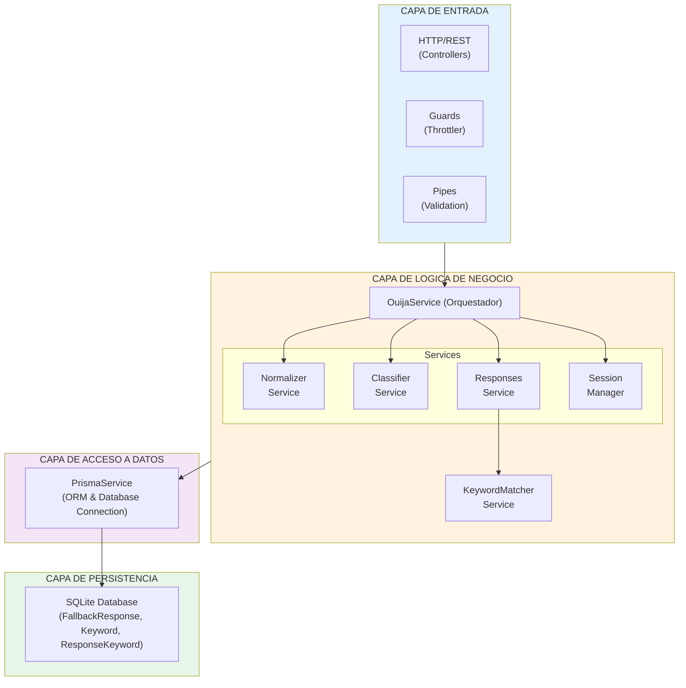
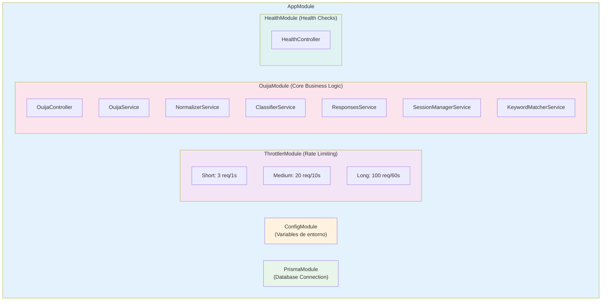
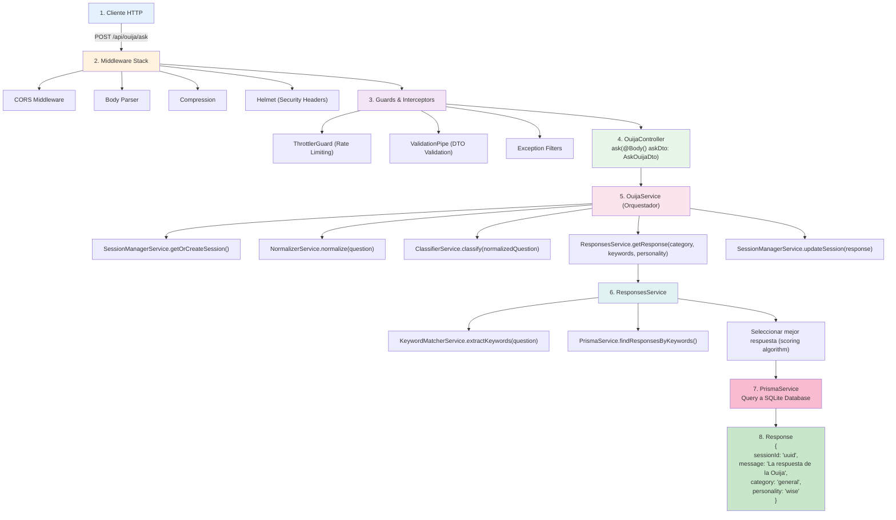
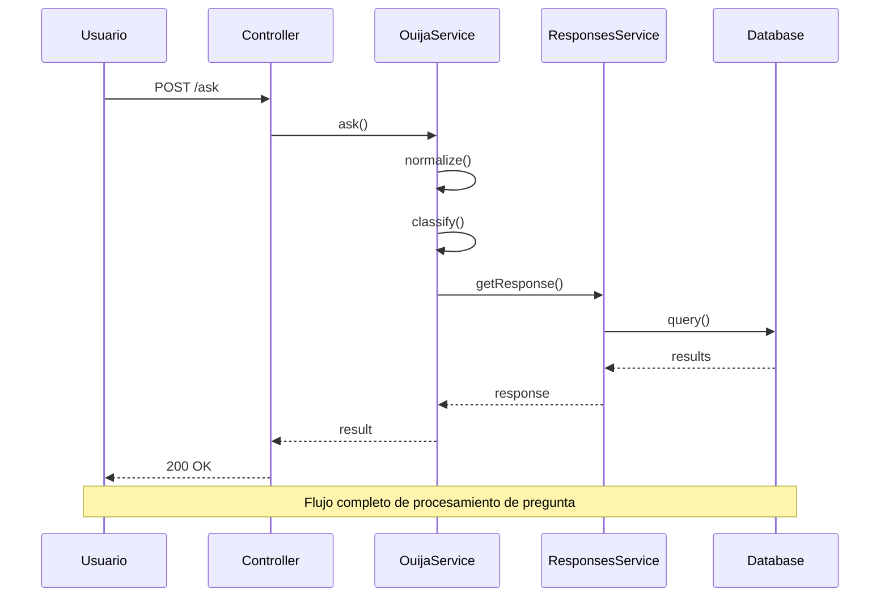

# Diagramas de Arquitectura

## Vision General

La arquitectura del backend de Ouija Virtual sigue una arquitectura en capas basada en NestJS, implementando principios SOLID y separacion de responsabilidades.

## Diagrama de Capas



## Diagrama de Componentes



## Flujo Request/Response

### Flujo de una Peticion de Pregunta



## Modulos de NestJS

### 1. AppModule (Raiz)

**Responsabilidad**: Configuracion global y orquestacion de modulos

**Imports**:
- `ConfigModule`: Gestion de variables de entorno con validacion
- `ThrottlerModule`: Rate limiting global
- `PrismaModule`: Conexion a base de datos
- `OuijaModule`: Logica principal del negocio
- `HealthModule`: Health checks

**Providers Globales**:
- `ThrottlerGuard`: Guard global para rate limiting

### 2. OuijaModule

**Responsabilidad**: Logica de negocio principal de la Ouija

**Controllers**:
- `OuijaController`: Endpoints REST para interaccion con la Ouija

**Services**:
- `OuijaService`: Orquestador principal del flujo de pregunta/respuesta
- `NormalizerService`: Normalizacion y limpieza de texto
- `ClassifierService`: Clasificacion de preguntas por categoria
- `ResponsesService`: Seleccion y recuperacion de respuestas
- `SessionManagerService`: Gestion de sesiones de usuario
- `KeywordMatcherService`: Extraccion y matching de keywords

### 3. PrismaModule

**Responsabilidad**: Acceso a base de datos

**Providers**:
- `PrismaService`: Cliente de Prisma con conexion a SQLite

**Features**:
- Conexion automatica al iniciar
- Desconexion segura al terminar
- Manejo de transacciones
- Connection pooling

### 4. HealthModule

**Responsabilidad**: Health checks y monitoreo

**Controllers**:
- `HealthController`: Endpoint `/health` para status checks

**Features**:
- Health check de aplicacion
- Health check de base de datos
- Metricas de sistema

## Patrones de Diseno Implementados

### 1. Dependency Injection

Todos los servicios son inyectados mediante el contenedor de IoC de NestJS:

```typescript
@Injectable()
export class OuijaService {
  constructor(
    private readonly normalizerService: NormalizerService,
    private readonly classifierService: ClassifierService,
    private readonly responsesService: ResponsesService,
    private readonly sessionManager: SessionManagerService,
  ) {}
}
```

### 2. Service Layer Pattern

Separacion clara entre controladores (capa de presentacion) y servicios (logica de negocio).

### 3. Repository Pattern

`PrismaService` actua como repository abstrayendo el acceso a datos.

### 4. Strategy Pattern

`ClassifierService` puede implementar diferentes estrategias de clasificacion.

### 5. Singleton Pattern

Todos los servicios NestJS son singletons por defecto.

## Consideraciones de Escalabilidad

### Escalabilidad Horizontal

- **Stateless Design**: Sesiones manejadas con IDs, permitiendo multiples instancias
- **Database**: SQLite para desarrollo, facilmente migrable a PostgreSQL/MySQL para produccion
- **Rate Limiting**: Configurado a nivel de aplicacion, puede moverse a API Gateway

### Escalabilidad Vertical

- **Connection Pooling**: Prisma maneja pool de conexiones eficientemente
- **Async Processing**: Todo el flujo es asincrono con Promises

## Diagramas de Secuencia

### Secuencia: Procesar Pregunta



## Flujo de Datos

### Entrada de Datos

1. **Validacion**: DTOs con class-validator
2. **Normalizacion**: Limpieza y estandarizacion
3. **Procesamiento**: Extraccion de features (keywords, categoria)
4. **Persistencia**: Actualizacion de sesion

### Salida de Datos

1. **Serializacion**: Conversion a JSON
2. **Transformacion**: DTOs de respuesta
3. **Compresion**: Middleware de compresion
4. **Delivery**: HTTP Response

## Referencias

- [Documentacion de NestJS](https://docs.nestjs.com/)
- [Prisma Documentation](https://www.prisma.io/docs/)
- [Arquitectura del Sistema](../design/ARCHITECTURE.md)

---