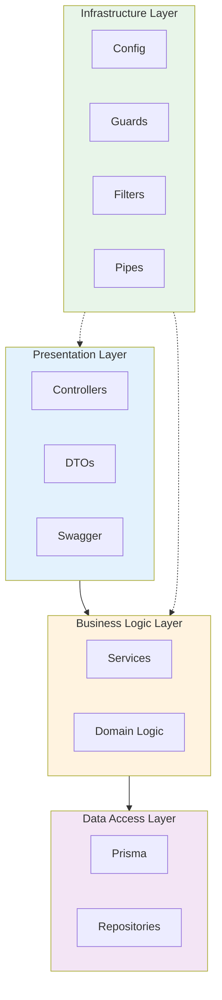
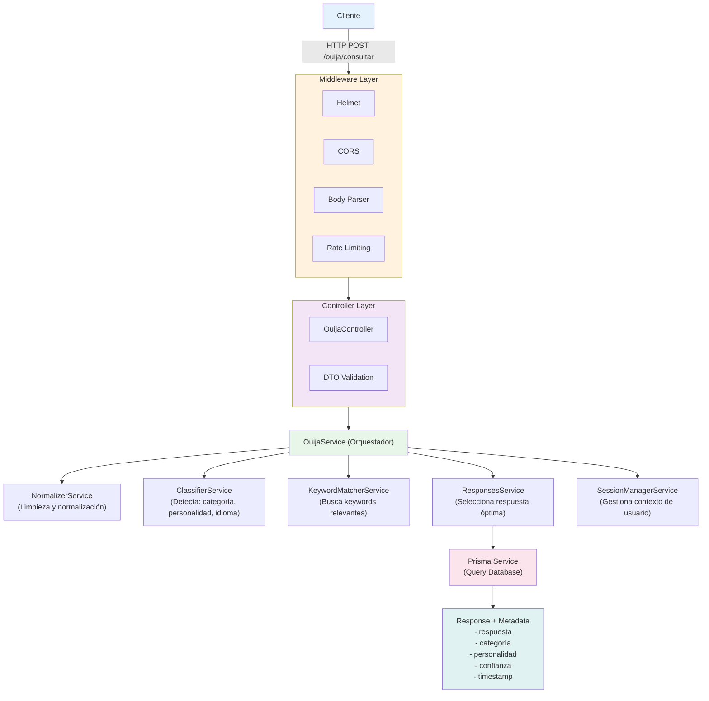

# Arquitectura del Sistema - Ouija Virtual Backend

## Vision General

Ouija Virtual Backend es una aplicacion backend construida con NestJS que proporciona respuestas misticas y enigmaticas basadas en consultas de usuarios. El sistema utiliza procesamiento de lenguaje natural, clasificacion de intenciones y un motor de respuestas inteligente para generar experiencias personalizadas.

## Stack Tecnologico

### Framework y Runtime
- **NestJS** - Framework progresivo de Node.js para aplicaciones empresariales
- **Node.js** - Runtime JavaScript del lado del servidor
- **TypeScript** - Superset tipado de JavaScript

### Base de Datos
- **Prisma** - ORM moderno para Node.js y TypeScript
- **SQLite** - Base de datos embebida para desarrollo local

### Seguridad y Validacion
- **Helmet** - Conjunto de middlewares para proteger headers HTTP
- **class-validator** - Validacion declarativa de DTOs
- **class-transformer** - Transformacion de objetos plain a instancias de clase
- **Throttler** - Rate limiting para proteccion contra abuso

### Documentacion
- **Swagger/OpenAPI** - Documentacion interactiva de API

## Arquitectura en Capas

El sistema sigue una arquitectura en capas bien definida:



### 1. Presentation Layer (Capa de Presentacion)

**Responsabilidad**: Manejo de HTTP requests/responses, validacion de entrada, documentacion

**Componentes**:
- **Controllers**: `ouija.controller.ts`, `health.controller.ts`
- **DTOs**: Objetos de transferencia de datos con validaciones
- **Swagger Decorators**: Documentacion automatica de endpoints

**Caracteristicas**:
- Validacion de entrada con `class-validator`
- Transformacion automatica de datos
- Documentacion OpenAPI/Swagger
- Manejo de errores con filtros personalizados

### 2. Business Logic Layer (Capa de Logica de Negocio)

**Responsabilidad**: Implementacion de reglas de negocio y logica de dominio

**Componentes**:
- `OuijaService` - Orquestador principal
- `NormalizerService` - Normalizacion de texto
- `ClassifierService` - Clasificacion de intenciones
- `KeywordMatcherService` - Matching de palabras clave
- `ResponsesService` - Gestion de respuestas
- `SessionManagerService` - Gestion de sesiones de usuario

**Patrones Aplicados**:
- **Strategy Pattern**: Diferentes estrategias de clasificacion
- **Chain of Responsibility**: Pipeline de procesamiento de texto
- **Service Layer**: Separacion de logica de negocio

### 3. Data Access Layer (Capa de Acceso a Datos)

**Responsabilidad**: Interaccion con la base de datos

**Componentes**:
- `PrismaService` - Cliente de Prisma configurado
- **Modelos**:
  - `FallbackResponse` - Respuestas predefinidas
  - `Keyword` - Palabras clave para matching
  - `ResponseKeyword` - Tabla de union many-to-many

**Caracteristicas**:
- ORM type-safe con Prisma
- Migraciones automaticas
- Indices optimizados para queries frecuentes
- Relaciones many-to-many con cascade delete

### 4. Infrastructure Layer (Capa de Infraestructura)

**Responsabilidad**: Configuracion, seguridad, cross-cutting concerns

**Componentes**:
- **Configuration**: `ConfigModule`, validacion de variables de entorno
- **Guards**: `ThrottlerGuard` para rate limiting
- **Filters**: `AllExceptionsFilter`, `ThrottlerExceptionFilter`
- **Pipes**: `ValidationPipe` global
- **Middleware**: Helmet, CORS, body parser

## Modulos de NestJS

### AppModule
**Proposito**: Modulo raiz que importa todos los demas modulos

**Imports**:
- `ConfigModule` - Configuracion global
- `ThrottlerModule` - Rate limiting con 3 niveles
- `OuijaModule` - Funcionalidad principal
- `PrismaModule` - Acceso a base de datos
- `HealthModule` - Health checks

**Providers Globales**:
- `ThrottlerGuard` - Aplicado a todas las rutas excepto health

### OuijaModule
**Proposito**: Encapsula toda la funcionalidad del sistema Ouija

**Controllers**: `OuijaController`

**Providers**:
- `OuijaService` - Orquestador
- `NormalizerService` - Procesamiento de texto
- `ClassifierService` - Clasificacion
- `ResponsesService` - Gestion de respuestas
- `SessionManagerService` - Sesiones
- `KeywordMatcherService` - Matching

### PrismaModule
**Proposito**: Proporciona acceso a la base de datos

**Exports**: `PrismaService` (disponible globalmente)

### HealthModule
**Proposito**: Endpoints de monitoreo y health checks

**Controllers**: `HealthController`

## Patrones de Diseno Implementados

### 1. Dependency Injection (DI)
**Implementacion**: NestJS IoC container

**Beneficios**:
- Bajo acoplamiento entre componentes
- Facil testing con mocks
- Configuracion centralizada

**Ejemplo**:
```typescript
@Injectable()
export class OuijaService {
  constructor(
    private readonly normalizer: NormalizerService,
    private readonly classifier: ClassifierService,
    private readonly responses: ResponsesService,
  ) {}
}
```

### 2. Repository Pattern
**Implementacion**: Prisma como capa de abstraccion

**Beneficios**:
- Separacion de logica de datos
- Queries type-safe
- Facil cambio de base de datos

### 3. DTO Pattern
**Implementacion**: Clases con decoradores de validacion

**Beneficios**:
- Validacion automatica
- Documentacion en codigo
- Type safety

**Ejemplo**:
```typescript
export class ConsultarDto {
  @IsString()
  @IsNotEmpty()
  @MaxLength(500)
  pregunta: string;

  @IsEnum(['es', 'en'])
  @IsOptional()
  idioma?: 'es' | 'en';
}
```

### 4. Strategy Pattern
**Implementacion**: Diferentes estrategias de clasificacion y matching

**Beneficios**:
- Algoritmos intercambiables
- Extensible sin modificar codigo existente
- Testing aislado de cada estrategia

### 5. Chain of Responsibility
**Implementacion**: Pipeline de procesamiento de texto

**Flujo**:
1. Normalizacion
2. Clasificacion
3. Keyword matching
4. Seleccion de respuesta
5. Personalizacion

### 6. Module Pattern
**Implementacion**: Modulos de NestJS

**Beneficios**:
- Codigo organizado y escalable
- Lazy loading posible
- Encapsulacion clara

## Flujo de Request/Response



## Decisiones de Diseno Clave

### 1. Por que NestJS?
**Decision**: Usar NestJS en lugar de Express puro

**Rationale**:
- Arquitectura modular out-of-the-box
- TypeScript first-class support
- Dependency injection integrado
- Ecosistema rico (Swagger, testing, validation)
- Escalabilidad para aplicaciones enterprise

### 2. Por que Prisma?
**Decision**: Usar Prisma en lugar de TypeORM o raw SQL

**Rationale**:
- Type safety excepcional
- Migraciones automaticas
- Query builder intuitivo
- Performance optimizada
- Developer experience superior

### 3. Arquitectura de Servicios
**Decision**: Multiples servicios pequenos en lugar de un servicio monolitico

**Rationale**:
- Single Responsibility Principle
- Testing mas facil
- Reutilizacion de componentes
- Mantenimiento simplificado

### 4. Rate Limiting Multi-Nivel
**Decision**: Implementar 3 niveles de throttling (short, medium, long)

**Rationale**:
- Proteccion granular contra abuso
- Balance entre seguridad y UX
- Diferentes ventanas temporales para diferentes patrones de ataque
- Burst traffic permitido pero controlado

### 5. Validacion en DTO
**Decision**: Validacion declarativa con decoradores

**Rationale**:
- Fail fast: errores detectados antes de llegar a logica de negocio
- Documentacion en codigo
- Reutilizacion de reglas de validacion
- Mensajes de error consistentes

### 6. Global Exception Filters
**Decision**: Filtros de excepcion centralizados

**Rationale**:
- Manejo consistente de errores
- Logging centralizado
- Respuestas de error estandarizadas
- Facilita debugging

### 7. SQLite como Base de Datos
**Decision**: Usar SQLite como base de datos del proyecto

**Rationale**:
- Setup rapido sin dependencias externas
- Portabilidad entre desarrolladores
- Sin necesidad de servidor de base de datos
- Ideal para desarrollo y prototipado
- Prisma facilita migraciones futuras si es necesario

## Arquitectura Preparada para Escalabilidad

### Diseño Stateless
**Implementacion actual**:
- Sin estado en servidor (sesiones en memoria para desarrollo)
- API REST sin dependencias de sesión HTTP
- Preparado para escalabilidad futura

### Optimizaciones Actuales
**Base de Datos**:
- Indices en columnas frecuentemente consultadas
- Connection pooling de Prisma
- Queries optimizadas con select específico


## Seguridad

### Medidas Implementadas
1. **Helmet**: Headers de seguridad HTTP
2. **CORS**: Whitelist de origenes permitidos
3. **Rate Limiting**: Multi-nivel con Throttler
4. **Input Validation**: DTOs con class-validator
5. **Request Size Limiting**: 10KB max payload
6. **Content Security Policy**: Configurado en Helmet

## Monitoreo y Observabilidad

### Health Checks
**Endpoints disponibles**:
- `GET /health` - Liveness check (API funcionando)
- `GET /health/ready` - Readiness check (listo para tráfico)
- `GET /health/detailed` - Métricas detalladas del sistema

**Checks incluidos**:
- Estado de la aplicación
- Conectividad a base de datos
- Uso de memoria (heap y RSS)
- Métricas de sistema

### Logging
**Implementación actual**: Logger integrado de NestJS

**Niveles disponibles**:
- Error - Errores críticos
- Warn - Advertencias
- Log - Información general
- Debug - Información detallada para debugging

**Estrategia**:
- Logs estructurados para facilitar análisis
- No se loguean datos sensibles
- Contexto incluido en cada log (servicio, método)

## Testing Strategy

### Enfoque de Testing Actual
**Testing HTTP con REST Client**:
- Tests manuales y automatizables con archivos `.http`
- Documentación ejecutable de la API
- Testing de integración directo sobre endpoints HTTP
- ~115 casos de prueba organizados por funcionalidad

### Estructura de Tests
```
test/http/
├── 01-health.http              # Health checks (3 tests)
├── 02-ouija-basic.http         # Funcionalidad básica (6 tests)
├── 03-ouija-categories.http    # Categorías (17 tests)
├── 04-ouija-personalities.http # Personalidades (15 tests)
├── 05-ouija-sessions.http      # Sesiones (20+ tests)
├── 06-ouija-languages.http     # Idiomas (25+ tests)
└── 07-ouija-validation.http    # Validación (30+ tests)
```

### Cobertura de Testing
**Áreas cubiertas**:
- ✅ Health checks (liveness, readiness, detailed)
- ✅ Funcionalidad básica de consultas
- ✅ Clasificación por categorías (8 categorías)
- ✅ Personalidades del espíritu (4 tipos)
- ✅ Anti-repetición de respuestas
- ✅ Soporte multiidioma (ES/EN)
- ✅ Validación de entrada y manejo de errores


## Migraciones y Versionado

### Database Migrations
**Herramienta**: Prisma Migrate

**Workflow de Desarrollo**:
1. Modificar `schema.prisma`
2. Ejecutar `npm run prisma:migrate` para crear y aplicar migración
3. Commit de migraciones a Git
4. En otros entornos: `npm run prisma:migrate:deploy` para aplicar


## Referencias y Recursos

- [NestJS Documentation](https://docs.nestjs.com)
- [Prisma Documentation](https://www.prisma.io/docs)
- [TypeScript Handbook](https://www.typescriptlang.org/docs)
- [Clean Architecture](https://blog.cleancoder.com/uncle-bob/2012/08/13/the-clean-architecture.html)

---